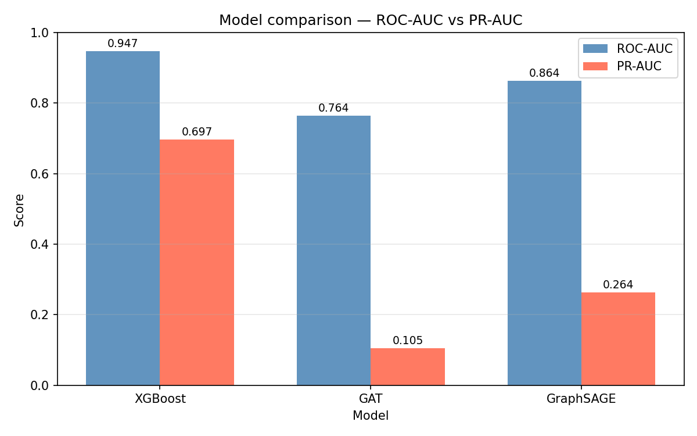

# Fraud Detection with Graph Neural Networks

Credit card fraud detection on the [IEEE-CIS Kaggle dataset](https://www.kaggle.com/competitions/ieee-fraud-detection) using heterogeneous Graph Neural Networks.

The key idea: fraudsters tend to reuse the same card, email domain, and device across multiple transactions. A standard tabular model sees each transaction in isolation, but a GNN can propagate fraud signals through these shared entities — a transaction linked to a card with a history of fraud should look suspicious even if its own features seem clean.

## Results

Trained on the full dataset (590,540 transactions, 3.5% fraud rate):

| Model | ROC-AUC | PR-AUC | F1 |
|---|---|---|---|
| XGBoost (baseline) | 0.947 | 0.697 | 0.428 |
| GraphSAGE | 0.864 | 0.264 | 0.223 |
| GAT (HANConv) | 0.764 | 0.105 | 0.159 |

XGBoost wins on tabular metrics — not surprising given the heavily engineered Vesta features. The GNN models add value in how they model entity relationships, and GraphSAGE is the better production candidate since it's inductive (handles new cards/emails at inference time).



## Graph Structure

The dataset is converted into a heterogeneous PyG graph with four node types:

- `transaction` — one node per row, labeled fraud/legit
- `card` — unique `card1` values
- `email` — unique `P_emaildomain` values  
- `device` — unique `DeviceInfo` values

Edges connect transactions to the card, email, and device they used (bidirectional). The GNN aggregates neighborhood information across these connections during message passing.

## Setup

```bash
python3 -m venv venv
source venv/bin/activate

pip install torch torchvision torchaudio
pip install torch_geometric
pip install -r requirements.txt
```

Download the data from Kaggle and place CSVs in `data/raw/`:

```bash
kaggle competitions download -c ieee-fraud-detection -p data/raw/
unzip data/raw/ieee-fraud-detection.zip -d data/raw/
```

## Running

```bash
# XGBoost baseline only (fast sanity check)
python run.py --model baseline

# Train a GNN
python run.py --model gat
python run.py --model sage

# Train all three and generate comparison chart
python run.py --model all
```

The graph is built once and cached at `data/processed/hetero_graph.pt`. Use `--rebuild_graph` to force a rebuild.

## Project Structure

```
src/
  data/
    load.py           # load + preprocess IEEE-CIS CSVs
    graph_builder.py  # build HeteroData graph from DataFrame
  models/
    gat.py            # FraudGAT using HANConv
    graphsage.py      # FraudSAGE using SAGEConv + to_hetero()
    xgb_baseline.py   # XGBoost with 5-fold CV
  training/
    train.py          # training loop, checkpointing
    evaluate.py       # metrics + comparison chart
  explain/
    gnn_explainer.py  # GNNExplainer + pyvis subgraph visualization
notebooks/
  01_eda.ipynb        # exploratory data analysis
```

## Dataset

IEEE-CIS Fraud Detection — Vesta Corporation's real-world transaction data from a Kaggle competition. ~590k transactions, ~400 features per transaction. Raw data is gitignored.
